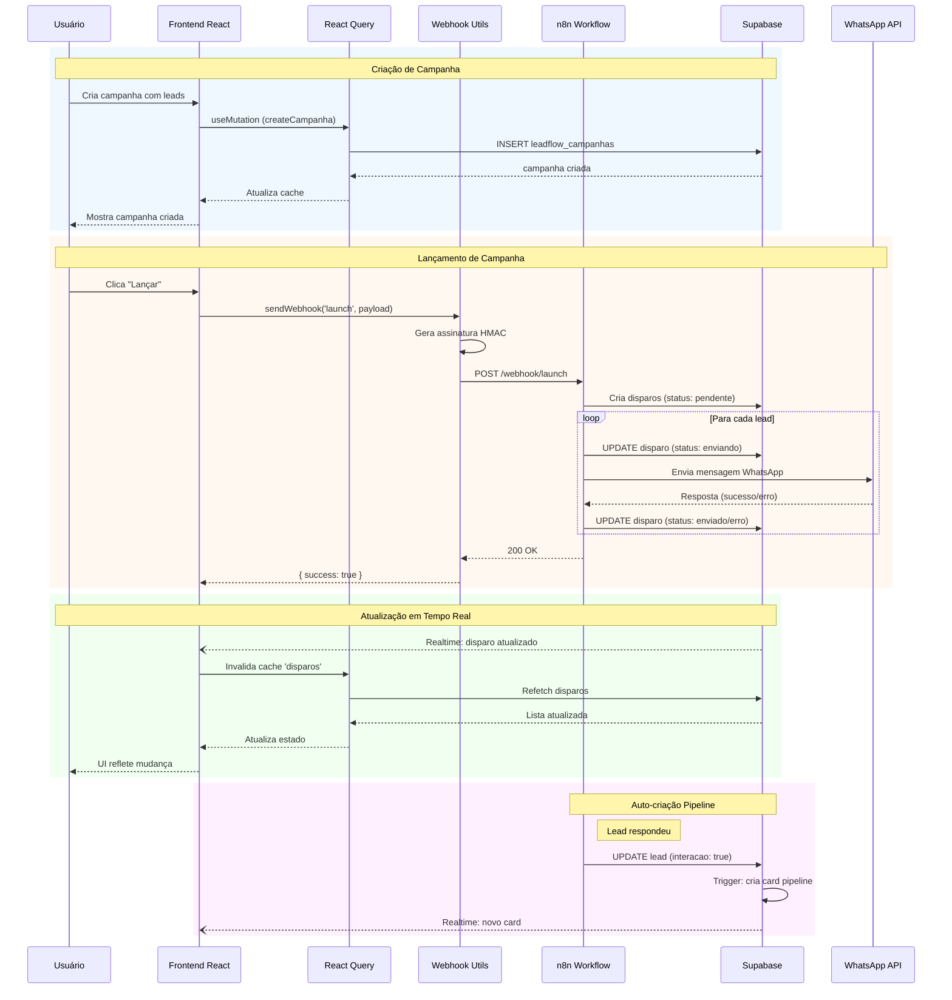
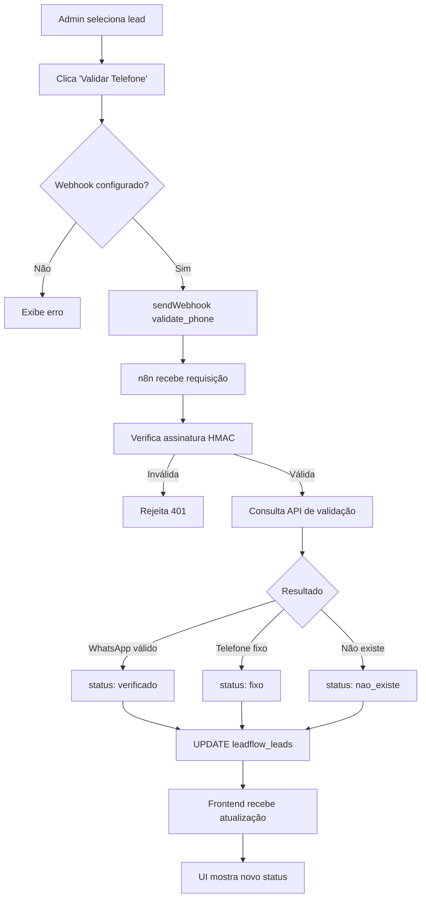
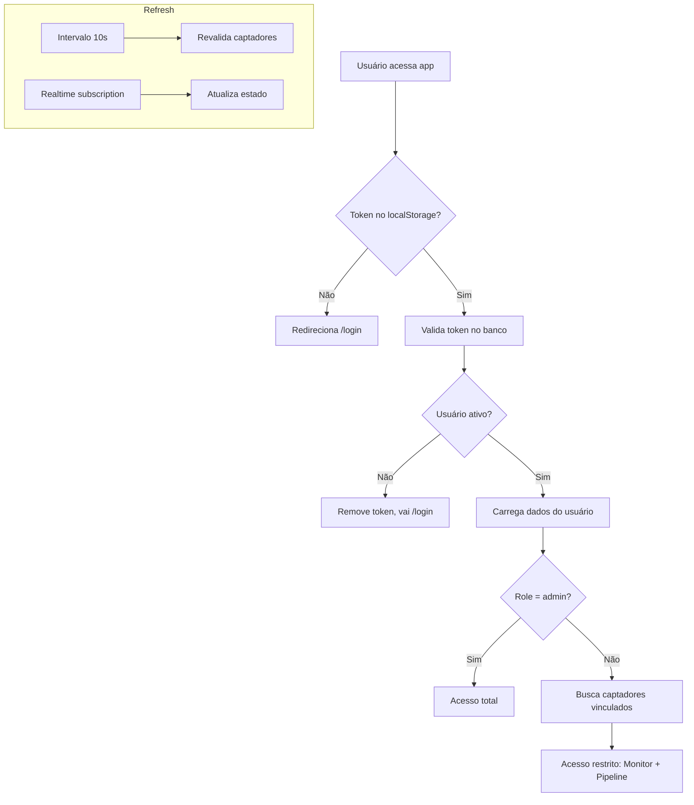
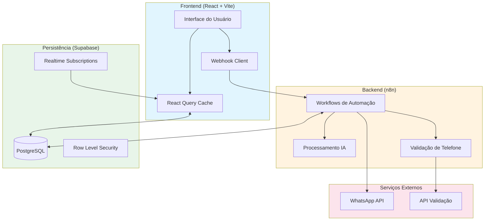
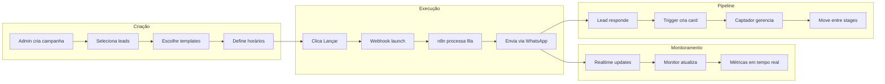

# LeadFlow Pro - Documentação Técnica Mestre

> **Versão:** 2.0.0
> **Última Atualização:** 05 de Fevereiro de 2026
> **Arquitetura:** Feature-Based com Hooks Layer
> **Projeto Supabase:** Vista Tech. (nrlnukkkrgtcnrsozbea)

---

## Sumário

1. [Visão Geral](#1-visão-geral)
2. [Stack Tecnológica](#2-stack-tecnológica)
3. [Arquitetura do Projeto](#3-arquitetura-do-projeto)
4. [Mapeamento de Pastas](#4-mapeamento-de-pastas)
5. [Integração com n8n (Backend IA)](#5-integração-com-n8n-backend-ia)
6. [Persistência com Supabase](#6-persistência-com-supabase)
7. [Fluxo de Dados](#7-fluxo-de-dados)
8. [Sistema de Autenticação](#8-sistema-de-autenticação)
9. [Variáveis de Ambiente](#9-variáveis-de-ambiente)
10. [Diagramas de Arquitetura](#10-diagramas-de-arquitetura)
11. [Melhorias Recomendadas](#11-melhorias-recomendadas)

---

## 1. Visão Geral

**LeadFlow Pro** é uma plataforma de gestão de leads e automação de campanhas WhatsApp, desenvolvida para o mercado imobiliário. O sistema integra:

- **Frontend React** para interface de usuário
- **n8n** como orquestrador de workflows e processamento de IA
- **Supabase** (PostgreSQL) para persistência de dados

### Funcionalidades Principais

| Módulo | Descrição |
|--------|-----------|
| **Dashboard** | Métricas consolidadas e visão geral do sistema |
| **Leads** | Gestão de contatos com validação de telefone via IA |
| **Captadores** | Gerenciamento de instâncias WhatsApp |
| **Campanhas** | Criação e execução de disparos em massa |
| **Monitor** | Acompanhamento em tempo real dos envios |
| **Pipeline** | Kanban para gestão do funil de vendas com busca por telefone |
| **Templates** | Editor de mensagens com spintext |

### Pipeline - Funcionalidades Detalhadas

O módulo Pipeline oferece uma interface Kanban completa para gestão de leads qualificados:

**Estágios do Funil:**
| Estágio | Cor | Descrição |
|---------|-----|-----------|
| Perdido | Cinza | Proprietários sem imóvel à venda |
| Acompanhamento | Amarelo | Precisa contato posterior |
| Indicação | Azul | Sem imóvel mas com indicação |
| Qualificado | Verde | Com imóvel à venda |
| Coleta de Dados | Roxo | Coletando informações |
| Captação Formalizada | Esmeralda | Dados no cadastro |
| Agendamentos | Laranja | Agendamentos de fotos/visitas |

**Busca por Telefone (Normalizada):**

O Pipeline possui busca inteligente que normaliza telefones para encontrar leads independente do formato:

```typescript
// Função de normalização - remove todos os caracteres não numéricos
const normalizePhone = (phone: string): string => {
  return phone.replace(/\D/g, "");
};

// Exemplos de busca que encontram o mesmo lead:
// - "5511947081611"
// - "(11) 94708-1611"
// - "11 94708-1611"
// - "947081611"
```

A busca também funciona por nome do lead, permitindo encontrar cards rapidamente em qualquer estágio do pipeline.

**Funcionalidades:**
- Drag-and-drop para mover cards entre estágios
- Busca por telefone ou nome (normalização automática)
- Contador de cards filtrados por estágio
- Observações por card
- Histórico de movimentações

---

## 2. Stack Tecnológica

### Dependências de Produção

| Pacote | Versão | Função |
|--------|--------|--------|
| `react` | ^18.3.1 | Framework de UI |
| `react-dom` | ^18.3.1 | Renderização DOM |
| `react-router-dom` | ^6.30.1 | Roteamento SPA |
| `@tanstack/react-query` | ^5.83.0 | Cache e gerenciamento de estado servidor |
| `@supabase/supabase-js` | ^2.93.3 | Cliente Supabase (banco + realtime) |
| `zod` | ^3.25.76 | Validação de schemas |
| `react-hook-form` | ^7.61.1 | Gerenciamento de formulários |
| `@hookform/resolvers` | ^3.10.0 | Integração zod + react-hook-form |
| `date-fns` | ^3.6.0 | Manipulação de datas |
| `recharts` | ^2.15.4 | Gráficos e visualizações |
| `sonner` | ^1.7.4 | Notificações toast |
| `lucide-react` | ^0.462.0 | Ícones |
| `tailwind-merge` | ^2.6.0 | Merge de classes Tailwind |
| `class-variance-authority` | ^0.7.1 | Variantes de componentes |
| `cmdk` | ^1.1.1 | Command palette |

### UI Components (Radix UI)

```
@radix-ui/react-accordion, alert-dialog, avatar, checkbox, collapsible,
context-menu, dialog, dropdown-menu, hover-card, label, menubar,
navigation-menu, popover, progress, radio-group, scroll-area, select,
separator, slider, slot, switch, tabs, toast, toggle, toggle-group, tooltip
```

### Dependências de Desenvolvimento

| Pacote | Versão | Função |
|--------|--------|--------|
| `vite` | ^5.4.19 | Build tool |
| `@vitejs/plugin-react-swc` | ^3.11.0 | Compilação React com SWC |
| `typescript` | ^5.8.3 | Tipagem estática |
| `vitest` | ^3.2.4 | Framework de testes |
| `tailwindcss` | ^3.4.17 | CSS utility-first |
| `eslint` | ^9.32.0 | Linting |

---

## 3. Arquitetura do Projeto

O projeto segue uma arquitetura **Feature-Based com Hooks Layer**, separando responsabilidades em camadas bem definidas:

```
┌─────────────────────────────────────────────────────────────────┐
│                         PRESENTATION                             │
│  ┌─────────────┐  ┌─────────────┐  ┌─────────────────────────┐  │
│  │   Pages     │  │  Components │  │    UI Components        │  │
│  │  (Routes)   │  │  (Shared)   │  │  (Radix + shadcn/ui)    │  │
│  └──────┬──────┘  └──────┬──────┘  └───────────┬─────────────┘  │
└─────────┼────────────────┼─────────────────────┼────────────────┘
          │                │                     │
          ▼                ▼                     ▼
┌─────────────────────────────────────────────────────────────────┐
│                        STATE LAYER                               │
│  ┌─────────────────┐  ┌─────────────────────────────────────┐   │
│  │  AuthContext    │  │  React Query (Cache + Mutations)    │   │
│  │  (Global Auth)  │  │  useLeads, useCampanhas, etc.       │   │
│  └────────┬────────┘  └──────────────────┬──────────────────┘   │
└───────────┼──────────────────────────────┼──────────────────────┘
            │                              │
            ▼                              ▼
┌─────────────────────────────────────────────────────────────────┐
│                      INTEGRATION LAYER                           │
│  ┌─────────────────────┐  ┌─────────────────────────────────┐   │
│  │   Supabase Client   │  │      Webhook Utilities          │   │
│  │  (Database + RT)    │  │  (n8n Communication)            │   │
│  └──────────┬──────────┘  └───────────────┬─────────────────┘   │
└─────────────┼─────────────────────────────┼─────────────────────┘
              │                             │
              ▼                             ▼
       ┌──────────────┐            ┌──────────────────┐
       │   Supabase   │            │       n8n        │
       │  (PostgreSQL)│            │   (Workflows)    │
       └──────────────┘            └──────────────────┘
```

---

## 4. Mapeamento de Pastas

```
leadflow-pro/
├── src/
│   ├── components/           # Componentes reutilizáveis
│   │   ├── ui/              # shadcn/ui (~60 componentes)
│   │   ├── AppSidebar.tsx   # Navegação lateral
│   │   ├── Layout.tsx       # Wrapper de layout
│   │   └── PrivateRoute.tsx # Proteção de rotas
│   │
│   ├── contexts/             # Estado global React
│   │   └── AuthContext.tsx  # Autenticação e sessão
│   │
│   ├── hooks/                # Custom hooks (React Query)
│   │   ├── useLeads.ts      # CRUD de leads
│   │   ├── useDisparos.ts   # Monitoramento de envios
│   │   ├── useCampanhas.ts  # Gestão de campanhas
│   │   ├── useCaptadores.ts # Instâncias WhatsApp
│   │   ├── usePipeline.ts   # Kanban/funil
│   │   ├── useTemplates.ts  # Templates de mensagem
│   │   └── useUsuarios.ts   # Gestão de usuários
│   │
│   ├── pages/                # Componentes de página (rotas)
│   │   ├── Dashboard.tsx    # Página inicial (admin)
│   │   ├── LeadsPage.tsx    # Gestão de leads
│   │   ├── CaptadoresPage.tsx
│   │   ├── CampanhasPage.tsx
│   │   ├── MonitorPage.tsx  # Tempo real
│   │   ├── PipelinePage.tsx # Kanban
│   │   ├── TemplatesPage.tsx
│   │   ├── AdminPage.tsx    # Configurações
│   │   └── LoginPage.tsx
│   │
│   ├── integrations/
│   │   └── supabase/
│   │       ├── client.ts    # Singleton do cliente
│   │       └── types.ts     # Tipos auto-gerados
│   │
│   ├── lib/
│   │   ├── webhook.ts       # Comunicação com n8n
│   │   ├── spintext.ts      # Processamento de templates
│   │   └── utils.ts         # Utilitários gerais
│   │
│   ├── App.tsx              # Router principal
│   ├── main.tsx             # Entry point
│   └── index.css            # Estilos globais
│
├── supabase/
│   └── migrations/           # Migrações SQL
│
├── package.json
├── vite.config.ts
├── tsconfig.json
└── tailwind.config.ts
```

### Papel de Cada Diretório

| Diretório | Responsabilidade |
|-----------|------------------|
| `components/ui/` | Biblioteca de componentes primitivos (shadcn/ui + Radix) |
| `components/` | Componentes de aplicação (Layout, Sidebar, PrivateRoute) |
| `contexts/` | Estado global via React Context (autenticação) |
| `hooks/` | Lógica de negócio e acesso a dados via React Query |
| `pages/` | Componentes de página vinculados às rotas |
| `integrations/` | Clientes de serviços externos (Supabase) |
| `lib/` | Utilitários puros (webhook, spintext, helpers) |
| `supabase/migrations/` | Versionamento do schema do banco |

---

## 5. Integração com n8n (Backend IA)

### Visão Geral

O n8n atua como backend de processamento, recebendo requisições do frontend para:
1. Disparar campanhas de mensagens
2. Validar números de telefone
3. Processar respostas com IA

### Endpoints de Webhook

| Ação | Variável de Ambiente | Descrição |
|------|---------------------|-----------|
| `launch` | `VITE_N8N_WEBHOOK_LAUNCH` | Inicia execução de campanha |
| `pause` | `VITE_N8N_WEBHOOK_PAUSE` | Pausa campanha em andamento |
| `resume` | `VITE_N8N_WEBHOOK_RESUME` | Retoma campanha pausada |
| `validate_phone` | `VITE_N8N_WEBHOOK_VALIDATE_PHONE` | Valida número de telefone |

### Estrutura de Requisição

```typescript
// Headers enviados em todas as requisições
{
  "Content-Type": "application/json",
  "X-Webhook-Timestamp": "1706745600000",      // Unix timestamp
  "X-Webhook-Action": "launch",                 // Tipo da ação
  "X-Webhook-Signature": "sha256_hash..."       // HMAC-SHA256
}
```

### Payload: Launch Campaign

```typescript
// POST para VITE_N8N_WEBHOOK_LAUNCH
{
  "campaign_id": "uuid-da-campanha",
  "campanha": {
    "nome": "Campanha Janeiro",
    "qtd_disparos": 500,
    "status": "ativa",
    "data_inicio": "2026-02-01",
    "horario_inicio": "08:00",
    "horario_fim": "18:00",
    "intervalo_minutos": 2,
    "disparos_por_hora": 30
  },
  "leads": [
    {
      "id_lead": "uuid-lead-1",
      "nome": "João Silva",
      "telefone": "5511999999999",
      "condominio": "Edifício Aurora"
    }
  ],
  "action": "launch",
  "timestamp": 1706745600000
}
```

### Payload: Validate Phone

```typescript
// POST para VITE_N8N_WEBHOOK_VALIDATE_PHONE
{
  "lead": {
    "id": "uuid-do-lead",
    "nome": "Maria Santos",
    "telefone": "5511988888888",
    "condominio": "Residencial Sol",
    "origem": "site"
  },
  "action": "validate_phone",
  "timestamp": 1706745600000
}
```

### Resposta Esperada do n8n

#### Validação de Telefone
```typescript
// O n8n deve atualizar diretamente no Supabase:
// leadflow_leads.status_telefone = "verificado" | "fixo" | "nao_existe" | "invalido"
// leadflow_leads.status_validacao = "validado" | "invalido"
```

#### Disparo de Mensagens
```typescript
// O n8n deve:
// 1. Criar registros em leadflow_disparos com status "pendente"
// 2. Atualizar para "enviando" ao processar
// 3. Atualizar para "enviado" ou "erro" após conclusão
// 4. Preencher erro_log em caso de falha
// 5. Marcar enviado_at com timestamp do envio
```

### Segurança dos Webhooks

```typescript
// Algoritmo de assinatura (webhook.ts)
async function generateSignature(payload: string, secret: string): Promise<string> {
  const encoder = new TextEncoder();
  const data = encoder.encode(payload + secret);
  const hashBuffer = await crypto.subtle.digest('SHA-256', data);
  const hashArray = Array.from(new Uint8Array(hashBuffer));
  return hashArray.map(b => b.toString(16).padStart(2, '0')).join('');
}
```

**Validação no n8n:**
1. Extrair `X-Webhook-Signature` do header
2. Recalcular hash: `SHA256(body + WEBHOOK_SECRET)`
3. Comparar hashes (timing-safe comparison)
4. Validar timestamp para evitar replay attacks

---

## 6. Persistência com Supabase

> **Projeto Supabase:** Vista Tech. (`nrlnukkkrgtcnrsozbea`)
> **Região:** East US (Ohio)
> **Última sincronização do schema:** Fevereiro 2026

### Schema do Banco de Dados

#### Tabela: `leadflow_usuarios`
Gerencia usuários do sistema com autenticação customizada.

| Coluna | Tipo | Nullable | Default | Descrição |
|--------|------|----------|---------|-----------|
| `id` | uuid | NOT NULL | `gen_random_uuid()` | PK, auto-gerado |
| `user_id` | uuid | NULL | - | ID Supabase Auth (reservado) |
| `nome` | text | NOT NULL | - | Nome completo |
| `email` | text | NOT NULL | - | Email único (UNIQUE) |
| `senha` | text | NULL | - | Senha do usuário |
| `role` | text | NOT NULL | `'captador'` | `admin` \| `captador` (CHECK constraint) |
| `ativo` | boolean | NULL | `true` | Status da conta |
| `created_at` | timestamptz | NULL | `now()` | Criação |
| `updated_at` | timestamptz | NULL | `now()` | Última atualização |

**Índices:**
- `leadflow_usuarios_pkey` - PRIMARY KEY (id)
- `leadflow_usuarios_email_key` - UNIQUE (email)
- `idx_usuarios_email` - INDEX (email)
- `idx_usuarios_user_id` - INDEX (user_id)

---

#### Tabela: `leadflow_leads`
Armazena contatos/leads importados para campanhas.

| Coluna | Tipo | Nullable | Default | Descrição |
|--------|------|----------|---------|-----------|
| `id` | uuid | NOT NULL | `gen_random_uuid()` | PK |
| `nome` | text | NOT NULL | - | Nome do lead |
| `telefone` | text | NOT NULL | - | Número WhatsApp |
| `telefoneFormatted` | text | NULL | - | Telefone formatado |
| `condominio` | text | NULL | - | Nome do empreendimento |
| `origem` | text | NULL | - | Fonte do lead |
| `status_telefone` | text | NULL | `'pendente'` | Resultado da validação |
| `interacao` | boolean | NOT NULL | `false` | Se lead respondeu |
| `created_at` | timestamptz | NOT NULL | `now()` | |
| `updated_at` | timestamptz | NOT NULL | `now()` | |

**Índices:**
- `leadflow_leads_pkey` - PRIMARY KEY (id)
- `idx_leads_interacao` - INDEX PARTIAL (interacao) WHERE interacao = true

**Triggers:**
- `leadflow_leads_updated_at` - BEFORE UPDATE → `leadflow_update_updated_at()`
- `trigger_criar_card_pipeline` - AFTER UPDATE → `criar_card_pipeline_on_interacao()`

---

#### Tabela: `leadflow_captadores`
Gerencia instâncias WhatsApp conectadas ao sistema.

| Coluna | Tipo | Nullable | Default | Descrição |
|--------|------|----------|---------|-----------|
| `id` | uuid | NOT NULL | `gen_random_uuid()` | PK |
| `nome_instancia` | varchar | NOT NULL | - | Nome da instância |
| `nome_captador` | varchar | NOT NULL | - | Nome amigável |
| `instancia` | varchar | NOT NULL | - | ID único da instância (UNIQUE) |
| `token` | text | NULL | - | Token de autenticação |
| `ativo` | boolean | NULL | `true` | Instância ativa |
| `telefone_cadastrado` | varchar | NULL | - | Número vinculado |
| `id_usuario` | uuid | NULL | - | FK → leadflow_usuarios |
| `created_at` | timestamptz | NULL | `now()` | |
| `updated_at` | timestamptz | NULL | `now()` | |

**Índices:**
- `leadflow_captadores_pkey` - PRIMARY KEY (id)
- `leadflow_captadores_instancia_key` - UNIQUE (instancia)
- `idx_captadores_id_usuario` - INDEX (id_usuario)

**Foreign Keys:**
- `leadflow_captadores_id_usuario_fkey` → `leadflow_usuarios(id)`

**Triggers:**
- `update_leadflow_captadores_updated_at` - BEFORE UPDATE → `update_updated_at_column()`

---

#### Tabela: `leadflow_campanhas`
Campanhas de disparo de mensagens em massa.

| Coluna | Tipo | Nullable | Default | Descrição |
|--------|------|----------|---------|-----------|
| `id` | uuid | NOT NULL | `gen_random_uuid()` | PK |
| `nome` | text | NOT NULL | - | Nome da campanha |
| `qtd_disparos` | integer | NOT NULL | `0` | Quantidade de mensagens |
| `status` | leadflow_status_campanha | NOT NULL | `'rascunho'` | Status atual |
| `data_inicio` | timestamptz | NULL | - | Data/hora programada |
| `horario_inicio` | time | NULL | `'08:00:00'` | Início do horário de envio |
| `horario_fim` | time | NULL | `'18:00:00'` | Fim do horário de envio |
| `intervalo_minutos` | integer | NULL | `5` | Intervalo entre envios |
| `disparos_por_hora` | integer | NULL | `12` | Rate limit |
| `leads` | jsonb | NULL | `'[]'` | Lista de leads selecionados |
| `templates` | jsonb | NULL | `'[]'` | Templates vinculados |
| `created_at` | timestamptz | NOT NULL | `now()` | |
| `updated_at` | timestamptz | NOT NULL | `now()` | |

**Índices:**
- `leadflow_campanhas_pkey` - PRIMARY KEY (id)

**Triggers:**
- `leadflow_campanhas_updated_at` - BEFORE UPDATE → `leadflow_update_updated_at()`

---

#### Tabela: `leadflow_disparos`
Registros individuais de mensagens enviadas.

| Coluna | Tipo | Nullable | Default | Descrição |
|--------|------|----------|---------|-----------|
| `id` | uuid | NOT NULL | `gen_random_uuid()` | PK |
| `id_campanha` | uuid | NOT NULL | - | FK → leadflow_campanhas |
| `id_lead` | uuid | NULL | - | FK → leadflow_leads |
| `id_captador` | uuid | NULL | - | FK → leadflow_captadores |
| `id_template` | uuid | NULL | - | FK → leadflow_templates |
| `nome` | text | NOT NULL | - | Nome do lead (snapshot) |
| `telefone` | text | NOT NULL | - | Telefone (snapshot) |
| `condominio` | text | NULL | - | Condomínio (snapshot) |
| `status_envio` | leadflow_status_envio | NOT NULL | `'pendente'` | Status do envio |
| `erro_log` | text | NULL | - | Detalhes do erro |
| `enviado_at` | timestamptz | NULL | - | Timestamp do envio |
| `created_at` | timestamptz | NOT NULL | `now()` | |
| `updated_at` | timestamptz | NOT NULL | `now()` | |

**Índices:**
- `leadflow_disparos_pkey` - PRIMARY KEY (id)

**Foreign Keys:**
- `leadflow_disparos_id_campanha_fkey` → `leadflow_campanhas(id)`
- `leadflow_disparos_id_lead_fkey` → `leadflow_leads(id)`
- `leadflow_disparos_id_captador_fkey` → `leadflow_captadores(id)`

**Triggers:**
- `update_leadflow_disparos_updated_at` - BEFORE UPDATE → `update_updated_at_column()`

---

#### Tabela: `leadflow_templates`
Templates de mensagem com suporte a spintext.

| Coluna | Tipo | Nullable | Default | Descrição |
|--------|------|----------|---------|-----------|
| `id` | uuid | NOT NULL | `gen_random_uuid()` | PK |
| `nome` | text | NOT NULL | - | Nome do template |
| `conteudo` | text | NOT NULL | - | Texto com spintext |
| `created_at` | timestamptz | NOT NULL | `now()` | |
| `updated_at` | timestamptz | NOT NULL | `now()` | |

**Índices:**
- `leadflow_templates_pkey` - PRIMARY KEY (id)

**Triggers:**
- `update_templates_updated_at` - BEFORE UPDATE → `update_updated_at_column()`

---

#### Tabela: `leadflow_pipeline`
Cards do pipeline Kanban para gestão de leads qualificados.

| Coluna | Tipo | Nullable | Default | Descrição |
|--------|------|----------|---------|-----------|
| `id` | uuid | NOT NULL | `gen_random_uuid()` | PK |
| `id_disparo` | uuid | NOT NULL | - | FK → leadflow_disparos (UNIQUE) |
| `id_captador` | uuid | NULL | - | FK → leadflow_captadores |
| `id_lead` | uuid | NULL | - | FK → leadflow_leads |
| `nome` | varchar | NOT NULL | - | Nome do lead |
| `telefone` | varchar | NOT NULL | - | Telefone do lead |
| `condominio` | varchar | NULL | - | Condomínio |
| `stage` | stage_pipeline | NOT NULL | `'acompanhamento'` | Stage atual do funil |
| `observacoes` | text | NULL | - | Notas do captador |
| `created_at` | timestamptz | NOT NULL | `now()` | |
| `updated_at` | timestamptz | NOT NULL | `now()` | |

**Índices:**
- `leadflow_pipeline_pkey` - PRIMARY KEY (id)
- `leadflow_pipeline_id_disparo_key` - UNIQUE (id_disparo)
- `idx_pipeline_captador` - INDEX (id_captador)
- `idx_pipeline_lead` - INDEX (id_lead)
- `idx_pipeline_stage` - INDEX (stage)
- `idx_pipeline_created_at` - INDEX (created_at DESC)

**Foreign Keys:**
- `leadflow_pipeline_id_disparo_fkey` → `leadflow_disparos(id)`
- `leadflow_pipeline_id_captador_fkey` → `leadflow_captadores(id)`
- `leadflow_pipeline_id_lead_fkey` → `leadflow_leads(id)`

**Triggers:**
- `trigger_set_pipeline_lead` - BEFORE INSERT/UPDATE → `set_pipeline_lead()`

---

#### Tabela: `leadflow_pipeline_historico`
Histórico de movimentações no pipeline.

| Coluna | Tipo | Nullable | Default | Descrição |
|--------|------|----------|---------|-----------|
| `id` | uuid | NOT NULL | `gen_random_uuid()` | PK |
| `id_pipeline` | uuid | NOT NULL | - | FK → leadflow_pipeline |
| `id_lead` | uuid | NULL | - | FK → leadflow_leads |
| `id_usuario` | uuid | NULL | - | FK → leadflow_usuarios |
| `stage_anterior` | stage_pipeline | NULL | - | Stage antes da mudança |
| `stage_novo` | stage_pipeline | NOT NULL | - | Stage após mudança |
| `movido_em` | timestamptz | NOT NULL | `now()` | Timestamp da mudança |

**Índices:**
- `leadflow_pipeline_historico_pkey` - PRIMARY KEY (id)
- `idx_pipeline_historico_pipeline` - INDEX (id_pipeline)
- `idx_pipeline_historico_lead` - INDEX (id_lead)
- `idx_pipeline_historico_usuario` - INDEX (id_usuario)
- `idx_pipeline_historico_movido_em` - INDEX (movido_em DESC)
- `uniq_pipeline_hist` - UNIQUE (id_pipeline, stage_anterior, stage_novo, movido_em)

**Foreign Keys:**
- `leadflow_pipeline_historico_id_pipeline_fkey` → `leadflow_pipeline(id)`
- `leadflow_pipeline_historico_id_lead_fkey` → `leadflow_leads(id)`
- `leadflow_pipeline_historico_id_usuario_fkey` → `leadflow_usuarios(id)`

**Triggers:**
- `trigger_hist_norm_dedupe` - BEFORE INSERT → `hist_norm_dedupe()`

---

#### Tabela: `leadflow_config`
Configurações gerais do sistema em formato chave-valor.

| Coluna | Tipo | Nullable | Default | Descrição |
|--------|------|----------|---------|-----------|
| `id` | uuid | NOT NULL | `gen_random_uuid()` | PK |
| `chave` | text | NOT NULL | - | Nome da configuração (UNIQUE) |
| `valor` | jsonb | NOT NULL | - | Valor da configuração |
| `created_at` | timestamptz | NOT NULL | `now()` | |
| `updated_at` | timestamptz | NOT NULL | `now()` | |

**Índices:**
- `leadflow_config_pkey` - PRIMARY KEY (id)
- `leadflow_config_chave_key` - UNIQUE (chave)

---

#### Tabela: `leadflow_historico_mensages`
Histórico de mensagens para sessões de chat/IA.

| Coluna | Tipo | Nullable | Default | Descrição |
|--------|------|----------|---------|-----------|
| `id` | integer | NOT NULL | `nextval(...)` | PK auto-incremento |
| `session_id` | varchar | NOT NULL | - | ID da sessão de conversa |
| `message` | jsonb | NOT NULL | - | Conteúdo da mensagem |

**Índices:**
- `leadflow_historico_mensages_pkey` - PRIMARY KEY (id)

---

### Enums do Banco

```sql
-- Status de campanhas
CREATE TYPE leadflow_status_campanha AS ENUM (
  'rascunho',    -- Campanha em edição
  'ativa',       -- Campanha em execução
  'pausada',     -- Campanha pausada
  'concluida'    -- Campanha finalizada
);

-- Status de envio de mensagens
CREATE TYPE leadflow_status_envio AS ENUM (
  'pendente',    -- Aguardando envio
  'enviando',    -- Em processamento
  'enviado',     -- Enviado com sucesso
  'erro'         -- Falha no envio
);

-- Stages do pipeline/funil (ordem lógica do funil)
CREATE TYPE stage_pipeline AS ENUM (
  'acompanhamento',       -- Em acompanhamento inicial
  'qualificado',          -- Lead qualificado
  'coleta_dados',         -- Coletando dados do imóvel
  'captacao_formalizada', -- Captação formalizada
  'agendamento',          -- Visita agendada
  'indicacao',            -- Indicação recebida
  'perdido'               -- Lead perdido
);
```

---

### Funções (Functions)

#### `leadflow_update_updated_at()`
Atualiza automaticamente o campo `updated_at` para o timestamp atual.

```sql
CREATE OR REPLACE FUNCTION leadflow_update_updated_at()
RETURNS TRIGGER AS $$
BEGIN
  NEW.updated_at = now();
  RETURN NEW;
END;
$$ LANGUAGE plpgsql;
```

**Usada por:** `leadflow_campanhas`, `leadflow_leads`

---

#### `update_updated_at_column()`
Função genérica para atualização de `updated_at`.

```sql
CREATE OR REPLACE FUNCTION update_updated_at_column()
RETURNS TRIGGER AS $$
BEGIN
  NEW.updated_at = NOW();
  RETURN NEW;
END;
$$ LANGUAGE plpgsql;
```

**Usada por:** `leadflow_captadores`, `leadflow_disparos`, `leadflow_templates`

---

#### `criar_card_pipeline_on_interacao()`
Cria automaticamente um card no pipeline quando um lead interage (responde).

```sql
CREATE OR REPLACE FUNCTION criar_card_pipeline_on_interacao()
RETURNS TRIGGER AS $$
DECLARE
  v_disparo RECORD;
BEGIN
  IF NEW.interacao = true AND (OLD.interacao IS NULL OR OLD.interacao = false) THEN
    -- Busca o disparo mais recente do lead
    SELECT d.id, d.id_captador, d.nome, d.telefone, d.condominio
    INTO v_disparo
    FROM leadflow_disparos d
    WHERE d.id_lead = NEW.id
    ORDER BY d.created_at DESC
    LIMIT 1;

    IF v_disparo.id IS NOT NULL THEN
      INSERT INTO leadflow_pipeline (id_disparo, id_captador, id_lead, nome, telefone, condominio)
      VALUES (v_disparo.id, v_disparo.id_captador, NEW.id, v_disparo.nome, v_disparo.telefone, v_disparo.condominio)
      ON CONFLICT (id_disparo) DO NOTHING;
    END IF;
  END IF;

  RETURN NEW;
END;
$$ LANGUAGE plpgsql;
```

**Trigger:** `trigger_criar_card_pipeline` em `leadflow_leads`

---

#### `set_pipeline_lead()`
Preenche automaticamente o `id_lead` no pipeline baseado no disparo.

```sql
CREATE OR REPLACE FUNCTION set_pipeline_lead()
RETURNS TRIGGER AS $$
BEGIN
  IF NEW.id_lead IS NULL THEN
    SELECT d.id_lead INTO NEW.id_lead
    FROM leadflow_disparos d
    WHERE d.id = NEW.id_disparo;
  END IF;
  RETURN NEW;
END;
$$ LANGUAGE plpgsql;
```

**Trigger:** `trigger_set_pipeline_lead` em `leadflow_pipeline`

---

#### `hist_norm_dedupe()`
Normaliza timestamps, preenche campos automaticamente e evita duplicatas no histórico.

```sql
CREATE OR REPLACE FUNCTION hist_norm_dedupe()
RETURNS TRIGGER AS $$
DECLARE
  v_id_usuario UUID;
  v_id_lead UUID;
  v_movido_em TIMESTAMPTZ;
BEGIN
  -- Normaliza timestamp (segundos)
  v_movido_em := date_trunc('second', COALESCE(NEW.movido_em, now()));
  NEW.movido_em := v_movido_em;

  -- Preenche id_lead se nulo
  IF NEW.id_lead IS NULL THEN
    SELECT p.id_lead INTO v_id_lead
    FROM leadflow_pipeline p
    WHERE p.id = NEW.id_pipeline;

    IF v_id_lead IS NULL THEN
      SELECT d.id_lead INTO v_id_lead
      FROM leadflow_disparos d
      JOIN leadflow_pipeline p ON p.id_disparo = d.id
      WHERE p.id = NEW.id_pipeline;
    END IF;

    NEW.id_lead := v_id_lead;
  END IF;

  -- Preenche id_usuario se nulo
  IF NEW.id_usuario IS NULL THEN
    SELECT c.id_usuario INTO v_id_usuario
    FROM leadflow_pipeline p
    JOIN leadflow_captadores c ON c.id = p.id_captador
    WHERE p.id = NEW.id_pipeline;

    NEW.id_usuario := v_id_usuario;
  END IF;

  -- Evita duplicar
  IF EXISTS (
    SELECT 1
    FROM leadflow_pipeline_historico h
    WHERE h.id_pipeline = NEW.id_pipeline
      AND h.stage_anterior IS NOT DISTINCT FROM NEW.stage_anterior
      AND h.stage_novo = NEW.stage_novo
      AND date_trunc('second', h.movido_em) = v_movido_em
  ) THEN
    RETURN NULL; -- ignora o insert duplicado
  END IF;

  RETURN NEW;
END;
$$ LANGUAGE plpgsql;
```

**Trigger:** `trigger_hist_norm_dedupe` em `leadflow_pipeline_historico`

---

### Resumo de Triggers

| Tabela | Trigger | Evento | Função |
|--------|---------|--------|--------|
| `leadflow_campanhas` | `leadflow_campanhas_updated_at` | BEFORE UPDATE | `leadflow_update_updated_at()` |
| `leadflow_captadores` | `update_leadflow_captadores_updated_at` | BEFORE UPDATE | `update_updated_at_column()` |
| `leadflow_disparos` | `update_leadflow_disparos_updated_at` | BEFORE UPDATE | `update_updated_at_column()` |
| `leadflow_leads` | `leadflow_leads_updated_at` | BEFORE UPDATE | `leadflow_update_updated_at()` |
| `leadflow_leads` | `trigger_criar_card_pipeline` | AFTER UPDATE | `criar_card_pipeline_on_interacao()` |
| `leadflow_pipeline` | `trigger_set_pipeline_lead` | BEFORE INSERT/UPDATE | `set_pipeline_lead()` |
| `leadflow_pipeline_historico` | `trigger_hist_norm_dedupe` | BEFORE INSERT | `hist_norm_dedupe()` |
| `leadflow_templates` | `update_templates_updated_at` | BEFORE UPDATE | `update_updated_at_column()` |

### Diagrama ER

```mermaid
erDiagram
    leadflow_usuarios ||--o{ leadflow_captadores : "possui"
    leadflow_usuarios ||--o{ leadflow_pipeline_historico : "registra"

    leadflow_captadores ||--o{ leadflow_disparos : "envia"
    leadflow_captadores ||--o{ leadflow_pipeline : "gerencia"

    leadflow_campanhas ||--o{ leadflow_disparos : "contém"

    leadflow_templates ||--o{ leadflow_disparos : "template_de"

    leadflow_leads ||--o{ leadflow_disparos : "recebe"
    leadflow_leads ||--o{ leadflow_pipeline : "vinculado"
    leadflow_leads ||--o{ leadflow_pipeline_historico : "histórico_lead"

    leadflow_disparos ||--|| leadflow_pipeline : "gera"

    leadflow_pipeline ||--o{ leadflow_pipeline_historico : "histórico"

    leadflow_usuarios {
        uuid id PK
        uuid user_id
        text nome
        text email
        text senha
        text role
        boolean ativo
        timestamptz created_at
        timestamptz updated_at
    }

    leadflow_leads {
        uuid id PK
        text nome
        text telefone
        text telefoneFormatted
        text condominio
        text origem
        text status_telefone
        boolean interacao
        timestamptz created_at
        timestamptz updated_at
    }

    leadflow_captadores {
        uuid id PK
        varchar nome_instancia
        varchar nome_captador
        varchar instancia UK
        text token
        boolean ativo
        varchar telefone_cadastrado
        uuid id_usuario FK
        timestamptz created_at
        timestamptz updated_at
    }

    leadflow_campanhas {
        uuid id PK
        text nome
        integer qtd_disparos
        enum status
        timestamptz data_inicio
        time horario_inicio
        time horario_fim
        integer intervalo_minutos
        integer disparos_por_hora
        jsonb leads
        jsonb templates
        timestamptz created_at
        timestamptz updated_at
    }

    leadflow_disparos {
        uuid id PK
        uuid id_campanha FK
        uuid id_lead FK
        uuid id_captador FK
        uuid id_template FK
        text nome
        text telefone
        text condominio
        enum status_envio
        text erro_log
        timestamptz enviado_at
        timestamptz created_at
        timestamptz updated_at
    }

    leadflow_templates {
        uuid id PK
        text nome
        text conteudo
        timestamptz created_at
        timestamptz updated_at
    }

    leadflow_pipeline {
        uuid id PK
        uuid id_disparo FK_UK
        uuid id_captador FK
        uuid id_lead FK
        varchar nome
        varchar telefone
        varchar condominio
        enum stage
        text observacoes
        timestamptz created_at
        timestamptz updated_at
    }

    leadflow_pipeline_historico {
        uuid id PK
        uuid id_pipeline FK
        uuid id_lead FK
        uuid id_usuario FK
        enum stage_anterior
        enum stage_novo
        timestamptz movido_em
    }

    leadflow_config {
        uuid id PK
        text chave UK
        jsonb valor
        timestamptz created_at
        timestamptz updated_at
    }

    leadflow_historico_mensages {
        integer id PK
        varchar session_id
        jsonb message
    }
```

### Configuração de Autenticação

O sistema utiliza **autenticação customizada** (não Supabase Auth):

```typescript
// Fluxo de login (AuthContext.tsx)
const signIn = async (email: string, senha: string) => {
  const { data, error } = await supabase
    .from("leadflow_usuarios")
    .select("id, nome, email, role, ativo")
    .eq("email", email.toLowerCase().trim())
    .eq("senha", senha)  // ⚠️ Comparação direta (ver melhorias)
    .eq("ativo", true)
    .maybeSingle();

  // Sessão salva em localStorage
  localStorage.setItem("leadflow_usuario", JSON.stringify(data));
};
```

### Row Level Security (RLS)

```sql
-- Políticas atuais permitem acesso público
-- A segurança é implementada na camada de aplicação
ALTER TABLE leadflow_usuarios ENABLE ROW LEVEL SECURITY;
CREATE POLICY "allow_all" ON leadflow_usuarios FOR ALL USING (true);
```

---

## 7. Fluxo de Dados

### Diagrama de Ciclo de Vida de Requisição



### Fluxo de Validação de Telefone



### Fluxo de Autenticação



---

## 8. Sistema de Autenticação

### Roles e Permissões

| Role | Dashboard | Leads | Captadores | Campanhas | Monitor | Pipeline | Templates | Admin |
|------|:---------:|:-----:|:----------:|:---------:|:-------:|:--------:|:---------:|:-----:|
| `admin` | ✅ | ✅ | ✅ | ✅ | ✅ | ✅ | ✅ | ✅ |
| `captador` | ❌ | ❌ | ❌ | ❌ | ✅* | ✅* | ❌ | ❌ |

*\* Captadores veem apenas dados de suas próprias instâncias*

### Implementação do PrivateRoute

```typescript
// src/components/PrivateRoute.tsx
export function PrivateRoute({ children, requireAdmin = false }) {
  const { usuario, loading, isAdmin, captadores } = useAuth();

  if (loading) return <LoadingSpinner />;

  // Não autenticado
  if (!usuario) return <Navigate to="/login" />;

  // Rota admin, mas usuário é captador
  if (requireAdmin && !isAdmin) return <Navigate to="/monitor" />;

  // Captador sem instâncias vinculadas
  if (!isAdmin && captadores.length === 0) {
    return <EmptyState message="Nenhum captador vinculado" />;
  }

  return children;
}
```

---

## 9. Variáveis de Ambiente

### Arquivo `.env`

```bash
# ══════════════════════════════════════════════════════════════
# SUPABASE - Banco de Dados e Realtime
# ══════════════════════════════════════════════════════════════
VITE_SUPABASE_PROJECT_ID=seu_project_id
VITE_SUPABASE_URL=https://seu_project_id.supabase.co
VITE_SUPABASE_PUBLISHABLE_KEY=eyJhbGciOiJIUzI1NiIsInR5cCI6IkpXVCJ9...

# ══════════════════════════════════════════════════════════════
# N8N - Webhooks de Automação
# ══════════════════════════════════════════════════════════════
VITE_N8N_WEBHOOK_LAUNCH=https://seu-n8n.com/webhook/launch-campanha
VITE_N8N_WEBHOOK_PAUSE=https://seu-n8n.com/webhook/pause-campanha
VITE_N8N_WEBHOOK_RESUME=https://seu-n8n.com/webhook/resume-campanha
VITE_N8N_WEBHOOK_VALIDATE_PHONE=https://seu-n8n.com/webhook/validate-phone

# ══════════════════════════════════════════════════════════════
# SEGURANÇA - Chave para assinatura HMAC
# ══════════════════════════════════════════════════════════════
VITE_N8N_WEBHOOK_SECRET=sua_chave_secreta_aqui
```

### Tabela de Variáveis

| Variável | Obrigatória | Descrição |
|----------|:-----------:|-----------|
| `VITE_SUPABASE_PROJECT_ID` | ✅ | ID do projeto Supabase |
| `VITE_SUPABASE_URL` | ✅ | URL da API Supabase |
| `VITE_SUPABASE_PUBLISHABLE_KEY` | ✅ | Chave pública (anon key) |
| `VITE_N8N_WEBHOOK_LAUNCH` | ✅ | Endpoint para lançar campanhas |
| `VITE_N8N_WEBHOOK_PAUSE` | ✅ | Endpoint para pausar campanhas |
| `VITE_N8N_WEBHOOK_RESUME` | ✅ | Endpoint para retomar campanhas |
| `VITE_N8N_WEBHOOK_VALIDATE_PHONE` | ⚠️ | Endpoint para validação (opcional) |
| `VITE_N8N_WEBHOOK_SECRET` | ⚠️ | Chave HMAC (recomendado) |

---

## 10. Diagramas de Arquitetura

### Visão Macro do Sistema



### Fluxo Completo de Campanha



---

## 11. Melhorias Recomendadas

### 🔴 Crítico - Segurança

#### 1. Autenticação de Senhas
**Problema:** Senhas armazenadas em texto plano e comparadas diretamente.

```typescript
// ❌ Atual (AuthContext.tsx:107-112)
.eq("senha", senha)  // Comparação direta

// ✅ Recomendado
import bcrypt from 'bcryptjs';

// No cadastro
const hashedPassword = await bcrypt.hash(senha, 12);

// No login
const isValid = await bcrypt.compare(senha, user.senha_hash);
```

#### 2. Row Level Security (RLS)
**Problema:** Políticas RLS permitem acesso público a todas as tabelas.

```sql
-- ❌ Atual
CREATE POLICY "allow_all" ON leadflow_usuarios FOR ALL USING (true);

-- ✅ Recomendado
CREATE POLICY "users_own_data" ON leadflow_usuarios
  FOR ALL USING (auth.uid() = user_id);

CREATE POLICY "captadores_by_user" ON leadflow_captadores
  FOR ALL USING (
    id_usuario IN (
      SELECT id FROM leadflow_usuarios WHERE user_id = auth.uid()
    )
  );
```

#### 3. Validação de Timestamp no Webhook
**Problema:** Não há validação de timestamp para prevenir replay attacks.

```typescript
// ✅ Adicionar no n8n
const MAX_AGE_MS = 5 * 60 * 1000; // 5 minutos
const timestamp = parseInt(headers['X-Webhook-Timestamp']);
const age = Date.now() - timestamp;

if (age > MAX_AGE_MS) {
  throw new Error('Request expired');
}
```

### 🟡 Importante - Robustez

#### 4. Tratamento de Erros nos Webhooks
**Problema:** Erros de rede não são tratados adequadamente.

```typescript
// ❌ Atual (webhook.ts)
return { success: true };  // Sem parsing da resposta

// ✅ Recomendado
const response = await fetch(webhookUrl, { ... });
const result = await response.json();

if (!response.ok) {
  return {
    success: false,
    error: result.message || `HTTP ${response.status}`,
    details: result
  };
}

return { success: true, data: result };
```

#### 5. Retry com Exponential Backoff
**Problema:** Falhas de rede não têm retry automático.

```typescript
// ✅ Adicionar retry logic
async function sendWebhookWithRetry(
  action: WebhookAction,
  payload: WebhookPayload,
  maxRetries = 3
) {
  for (let attempt = 0; attempt < maxRetries; attempt++) {
    try {
      const result = await sendWebhook(action, payload);
      if (result.success) return result;

      // Espera exponencial: 1s, 2s, 4s
      await new Promise(r => setTimeout(r, Math.pow(2, attempt) * 1000));
    } catch (error) {
      if (attempt === maxRetries - 1) throw error;
    }
  }
}
```

#### 6. Validação de Payload com Zod
**Problema:** Payloads de webhook não são validados antes do envio.

```typescript
// ✅ Adicionar schema validation
import { z } from 'zod';

const LaunchPayloadSchema = z.object({
  campaign_id: z.string().uuid(),
  campanha: z.object({
    nome: z.string().min(1),
    qtd_disparos: z.number().positive(),
    status: z.enum(['rascunho', 'ativa', 'pausada', 'concluida']),
  }),
  leads: z.array(z.object({
    id_lead: z.string().uuid(),
    nome: z.string(),
    telefone: z.string().regex(/^\d{10,15}$/),
  })).min(1),
});

// Antes de enviar
const validated = LaunchPayloadSchema.parse(payload);
```

### 🟢 Melhorias de UX

#### 7. Feedback Visual de Webhook
**Problema:** Usuário não sabe se webhook está processando.

```typescript
// ✅ Adicionar estado de loading e feedback
const [isLaunching, setIsLaunching] = useState(false);

const handleLaunch = async () => {
  setIsLaunching(true);
  toast.loading('Enviando para processamento...');

  const result = await sendWebhook('launch', payload);

  setIsLaunching(false);

  if (result.success) {
    toast.success('Campanha enviada! Acompanhe no Monitor.');
  } else {
    toast.error(`Falha: ${result.error}`);
  }
};
```

#### 8. Modo Offline
**Problema:** App não funciona sem conexão.

```typescript
// ✅ Adicionar detecção de offline
const { isOnline } = useNetworkStatus();

if (!isOnline) {
  return <OfflineBanner message="Sem conexão. Dados podem estar desatualizados." />;
}
```

### 📊 Monitoramento

#### 9. Logging Centralizado
**Problema:** Logs dispersos em console.log/console.error.

```typescript
// ✅ Implementar logger estruturado
const logger = {
  info: (msg: string, meta?: object) =>
    console.log(JSON.stringify({ level: 'info', msg, ...meta, ts: new Date() })),
  error: (msg: string, error?: Error, meta?: object) =>
    console.error(JSON.stringify({
      level: 'error', msg,
      error: error?.message,
      stack: error?.stack,
      ...meta, ts: new Date()
    })),
};

// Uso
logger.info('Webhook enviado', { action: 'launch', campaignId });
logger.error('Webhook falhou', error, { action: 'launch' });
```

#### 10. Métricas de Performance
**Problema:** Não há visibilidade sobre performance dos webhooks.

```typescript
// ✅ Adicionar métricas
const startTime = performance.now();
const result = await sendWebhook(action, payload);
const duration = performance.now() - startTime;

// Enviar para analytics
trackMetric('webhook_duration', duration, { action });
trackMetric('webhook_success', result.success ? 1 : 0, { action });
```

---

## Apêndice: Scripts Úteis

### Regenerar Tipos do Supabase

```bash
npx supabase gen types typescript --project-id $VITE_SUPABASE_PROJECT_ID > src/integrations/supabase/types.ts
```

### Build de Produção

```bash
npm run build
```

### Executar Testes

```bash
npm run test        # Executa uma vez
npm run test:watch  # Watch mode
```

---

> **Documento gerado automaticamente**
> Para atualizações, execute a análise novamente ou contribua diretamente no repositório.
